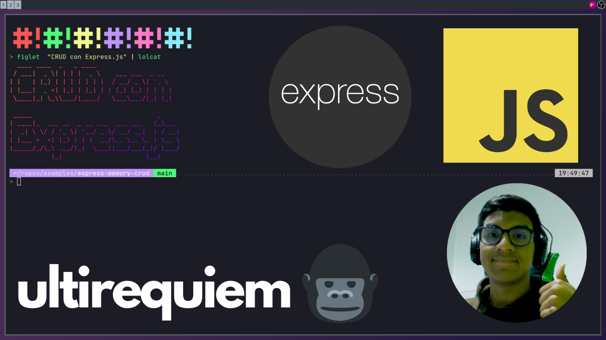

# Express CRUD Task API

> CRUD: CREATE, READ, UPDATE and DELETE

Express is a web framework for Nodje.js 🐢

[Live coding](https://youtu.be/mP2ZMpm8y3o) 👇

## Support

Open an Issue, I will check it a soon as possible 👀

If you want to hurry me up a bit
[send me a tweet](https://twitter.com/UltiRequiem) 😆

Consider [supporting me on Patreon](https://patreon.com/UltiRequiem) if you
like my work 🙏

Don't forget to start the repo ⭐

## Licence

Licensed under the MIT License 📄
